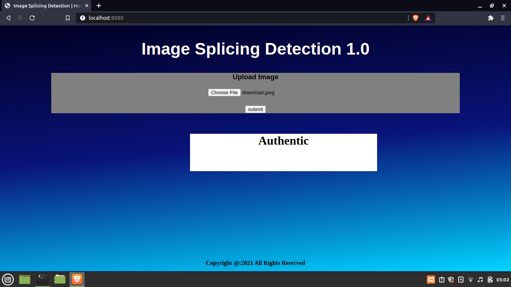

# image_splicing_detection
This is a complementary approach to detect spliced images that are widely created and used in the modern-day context. This program takes an image (JPG or PNG) and gives an output stating whether the uploaded image is spliced or not.

### Installation

To install this on your local machine, please execute following commands.

```
$ git clone https://github.com/Akalanka-1996/image_splicing_detection
$ cd image_splicing_detection
```

In order to run this application, it is **mandatory** to have installed [python](https://www.python.org/) and [node](https://nodejs.org/en/) in your system.

To run the **server.js** file, please execute following command.

```
$ node server.js
```

Execute following command to run the **python** file.

```
$ python prediction.py
```


Then go to the localhost:8080 and upload an image (JPG or PNG) through the form. When you click the submit button, the respective result for a particular image will be displayed.<br><br>


If the uploaded image is an **authentic** one, the result wolud be as follows.


<br><br>


The result of a **spliced** image would be like follows.


<br><br>


### Model building

Convolutional Neural Networks (CNN) has been used to build the model. Here, we have two convolutional layers and one max-pooling layer. We defined an early stop and the trained model is saved in **h5** format.

### Dataset

[CASIA 1](https://www.kaggle.com/sophatvathana/casia-dataset) is used to train this model. It has an ample amount of both spliced and authentic images.

### Flask API

In order to handle requests and responses between front-end and the back-end, a [flask](https://flask.palletsprojects.com/en/2.0.x/) API was built. User uploads an image thriugh web interface and the uploaded image will be sent to the back-end in binary format. The saved model in h5 format is loaded into the flask application. The result of a particular image will be sent beck to the front-end and displayed to the user.
